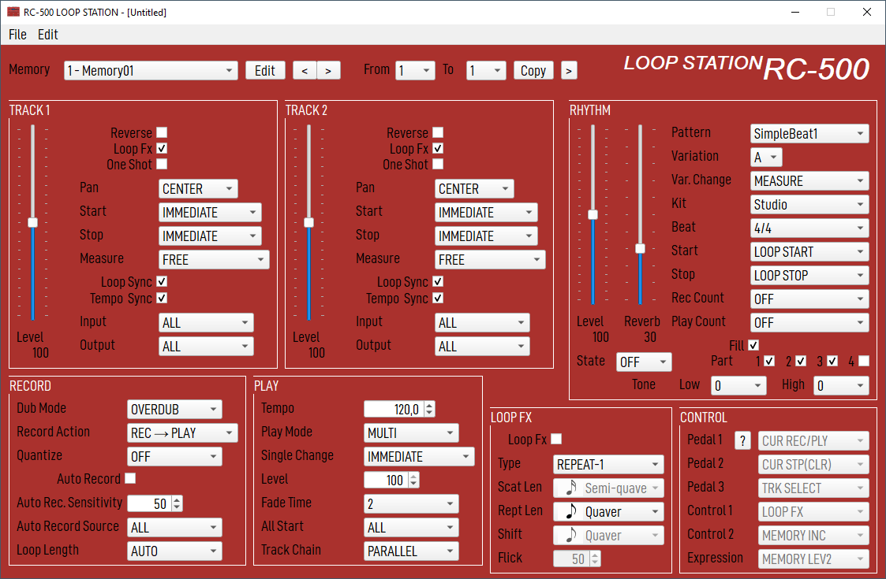
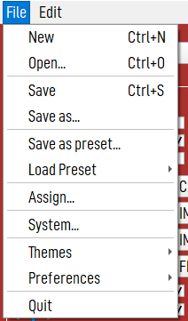
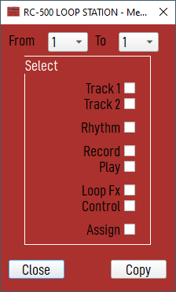
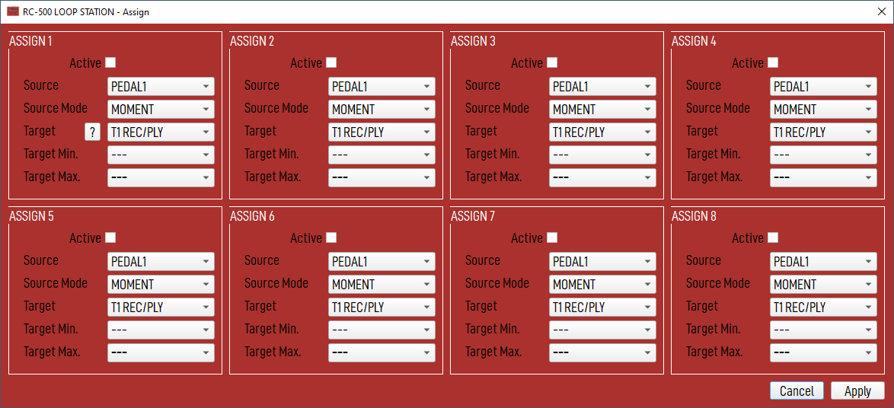
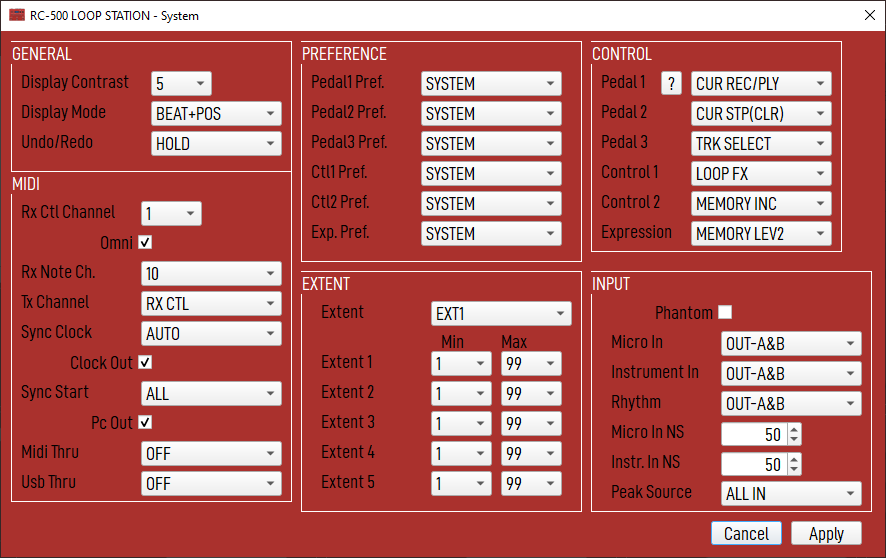

# RC-500 Loop Station Editor

This tool allows creating, updating and saving a configuration file for
the Boss RC-500 looper.

WARNING: This is an alpha-stage tool, under development, with no link
to Boss/Roland enterprise, and with probably a lot of issues. So, before
using it on your configuration files, make a backup.

## Download

You can find pre-built binaries for Windows 8.1 and 10, Linux and
MacOs Catalina [here](./downloads/).

I am currently using this tool under Linux Debian (bullseye).

## Basic Usage

When the tool starts, it loads a default configuration file, 
MEMORY_DEFAULT.RC0, in the resource directory.
So you can start creating a configuration file without your RC-500 
connected to your PC.

If your looper is connected, you can directly open the MEMORY1.RC0 file
from the connected disk, in ROLAND/DATA directory.

The window title will show you the filename you are currently editing.

## Main Menu

### New

Create a new database by reading the default ones provided in
resources/templates/MEMORY_DEFAULT.RC0 and resources/templates/SYSTEM_DEFAULT.RC0
A new database has no name, you will need to provide one when you
will save it to disk.

### Open

Open an existing directory which contains the memory and system
files (ROLAND/DATA for example).

### Save

Save the current databases into files.
For a new database, you will be prompted for a directory name on your
disk (or directly in your looper).

All files needed by the Boss RC500 looper will we writtent to disk
MEMORO1.RC0, MEMORY2.RC0, SYSTEM1.RC0 and  SYSTEM2.RC0.

It allows the looper to take in account the new files else it tries
to load one that contains the checksum (no computed by the tool)

### Memory

This list allows to change the current memory you are working on.
The list displays an extended version of the memory name. By default, only
the first 12 chars are displayed on the looper screen. Here, you can
write a longer description, only the first 12 will be seen on the looper
screen, but you can still see the longer form here.

Edit allows to change the current memory name.

### Copy

This option allow you to copy the current memory slot to range of memory  slots.
So you can easily duplicate your setting from a slot to some other quickly.

At the right of the Copy button, Advanced copy ('>') allow to copy the
selected parts to the destination.

### Assigns

This window allows you to edit the ASSIGN part of the looper.

#### Apply

Apply will apply the changes to the current memory selected in the main window.

#### Cancel

Cancel will revert any changes you have made.

### System

This window allows you to edit the SYSTEM part of the looper.

#### Apply 

Apply will apply the changes to global system database.

#### Cancel

Cancel will revert any changes you have made.
