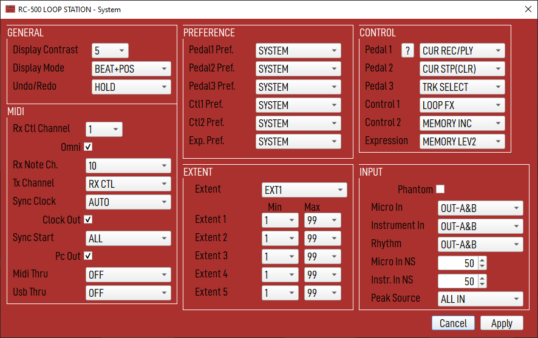

# RC-500 Loop Station Editor

Ce logiciel permet de créer, d'éditer et de sauver un fichier de configuration
pour le looper Boss RC-500.

ATTENTION: Ce logiciel est en phase de test, en cours de développement, qui n'a aucun 
lien avec la société Boss/Roland, et contient probablement énormement de bogues. Donc,
avant de l'utiliser, n'oubliez pas de faire une copie de sauvegarde de vos fichiers.

## Téléchargement

Vous pouvez trouver les binaires pré-compilés pour Windows 8.1 et 10, Linux et
MacOs Catalina [ici](http://simplecpp.free.fr/boss-rc500/downloads/).

Actuellement, j'utilise le logiciel sous Linux Debian Bullseye.

## Utilisation de base

Quand le logiciel démarre, il charge le fichier de configuration par défaut, 
`MEMORY_DEFAULT.RC0` présent dans le répertoire des ressources.
Ainsi, vous pouvez directement créer votre fichier de configuration sans avoir à brancher
le RC-500 à votre PC.

Si votre looper est connecté, vous pouvez directement ouvrir le répertoire `ROLAND/DATA`, 
celui contenant le fichier `MEMORY1.RC0` notamment.

Le titre de la fenètre affiche le nom du répertoire qui est actuellement ouvert.

## Menu Principal

### New

Crée un nouveau fichier de configuration en utilisant celui par défaut founit dans le fichier
`resources/templates/MEMORY_DEFAULT.RC0` et `resources/templates/SYSTEM_DEFAULT.RC0`.
Un nouveau fichier n'a pas de répertoire cible par défaut, vous devrez fournir un répertoire
quand vous allez sauver la nouvelle ocnfiguration.

### Open

Ouvre un répertoire existant contenant les fichiers de configuration des mémoires et du système
(`ROLAND/DATA` par example).

### Save

Sauve la configuration courante dans le répertoire cible.
Pour une nouvelle configuration, il vous sera demandé de choisir un répertoire de sortie
sur votre disque dur (ou directement votre looper).

Tous les fichiers nécessaires pour le RC-500 seront alors sauvegardés sur disques
`MEMORO1.RC0`, `MEMORY2.RC0`, `SYSTEM1.RC0` et `SYSTEM2.RC0`.

Cela permet au loooper de prendre en compte les modifications sans utiliser les précédents contenant
la valeur de version qui n'est pas générée ici.

### Memory

This list allows to change the current memory you are working on.
The list displays an extended version of the memory name. By default, only
the first 12 chars are displayed on the looper screen. Here, you can
write a longer description, only the first 12 will be seen on the looper
screen, but you can still see the longer form here.

Edit allows to change the current memory name.

### Copy

This option allow you to copy the current memory slot to range of memory  slots.
So you can easily duplicate your setting from a slot to some other quickly.

At the right of the Copy button, Advanced copy ('>') allow to copy the
selected parts to the destination.

### Assigns

This window allows you to edit the ASSIGN part of the looper.

#### Apply

Apply will apply the changes to the current memory selected in the main window.

#### Cancel

Cancel will revert any changes you have made.

### System

This window allows you to edit the SYSTEM part of the looper.

#### Apply 

Apply will apply the changes to global system database.

#### Cancel

Cancel will revert any changes you have made.
